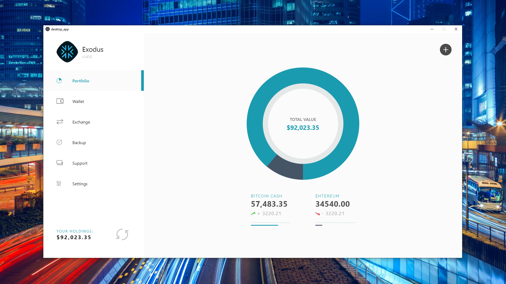

# desktop_app

## App results


## Project setup
```
npm install
```

### Compiles and hot-reloads for development
```
npm run electron:serve
```

### Compiles and minifies for production
```
npm run electron:build
```

### Create an installer
```
npm run postinstall
```